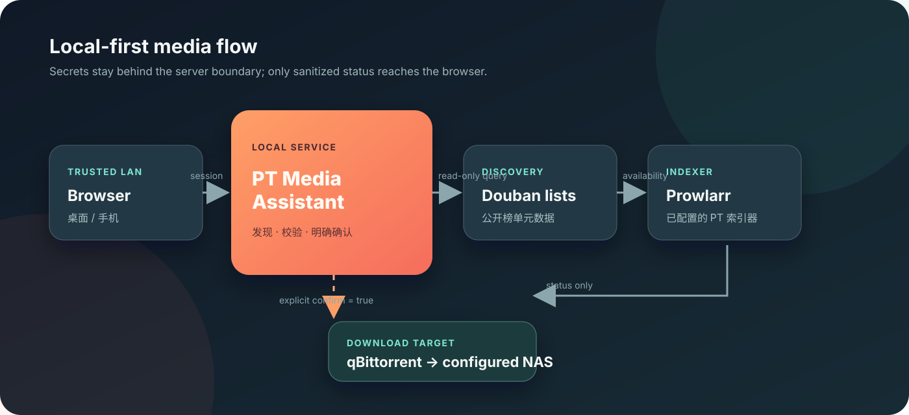
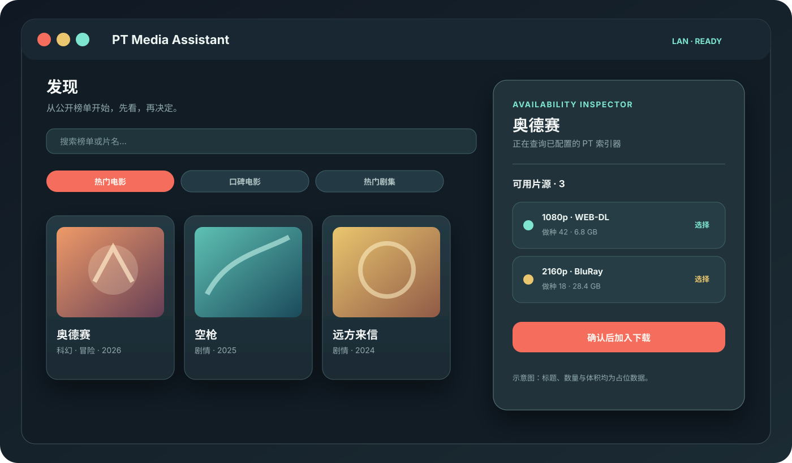
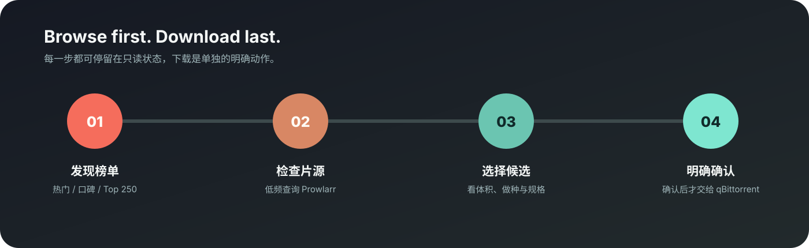

# PT Media Assistant

一个 **本地优先、局域网可访问、浏览优先** 的影视资源助手。

它把“我想看什么”到“确认下载”拆成可检查的几步：先浏览豆瓣公开榜单，再让 Prowlarr 查询已配置的 PT 索引器，最后由用户明确确认，才把选中的片源交给 qBittorrent。浏览器永远拿不到 Cookie、API key、passkey 或原始下载 URL。



## 为什么做它

很多下载工具从“输入一个精确片名”开始，但真实的观影选择往往更像这样：先逛热门或口碑榜单，打开一部片，再看看手头的 PT 有没有合适规格。这个项目把这条路径做成一个轻量 Web 界面：桌面端适合对比，手机端适合随手浏览和确认。



## 能做什么

- **榜单浏览**：提供热门电影、口碑电影、热门剧集、口碑剧集和 Top 250 五个固定的豆瓣公开集合入口。
- **片源检查**：打开条目后按需查询 Prowlarr，展示规格、体积、做种数等经过清洗的候选信息。
- **明确下载**：选择只生成预览；只有点击“加入下载”并确认后，服务端才会抓取片源。
- **运行状态**：顶部状态栏显示 NAS 剩余空间和进行中的下载数量；选中片源后可查看完整进度、速度和 ETA。
- **手机可用**：响应式布局；移动端把已选片源放进底部检查器，不需要滚到页面最下面寻找操作。
- **局域网优先**：默认监听局域网地址，适合家中 Mac 作为服务端、手机作为客户端的使用方式。

## 工作流



1. 在“发现”页浏览公开榜单，或切换到精确搜索。
2. 打开条目，按需查看 PT 可用片源；Prowlarr 查询有节流和超时保护。
3. 选择一个候选，检查体积、做种数、目标存储和当前下载状态。
4. 用户明确确认后，服务端再次检查会话、NAS 挂载和重复任务，再发送给 qBittorrent。

## 架构与隐私边界

```text
手机 / 桌面浏览器（可信局域网）
              │  sanitized JSON
              ▼
      PT Media Assistant :4178
        │              │
        │              ├── 豆瓣公开榜单（只读元数据）
        │              └── qBittorrent（状态 / 已确认任务）
        ▼
  Prowlarr（本机 API，Cookie 留在 Prowlarr）
        │
  已配置的 PT 索引器
        │
  qBittorrent ──► 用户配置的 NAS 下载目录
```

关键边界：

- PT 站 Cookie 只配置在 Prowlarr，应用不会读取或转发它。
- Prowlarr API key 只在服务端内存中使用，不进入浏览器响应和日志。
- 发布信息的原始下载 URL、GUID 和 tracker 字段只保留在服务端短期缓存中；浏览器只收到不透明的 release id。
- 豆瓣集合 id 是服务端固定映射，客户端不能提交任意上游 URL。
- 下载接口需要有效会话、来源校验、最新 NAS 挂载检查、不透明 release id，以及 `confirm: true`。

## 推荐：OrbStack 常驻部署

macOS 上推荐使用 OrbStack + Docker Compose。容器使用 `restart: unless-stopped`：应用进程异常退出、Docker 引擎重启或 OrbStack 随登录启动后，服务都会自动恢复。镜像自带健康检查，运行时采用非 root 用户、只读根文件系统、最小权限和有限日志。

```bash
# 首次部署：替换成自己的已挂载 NAS 目录。
PT_MEDIA_NAS_PATH=/Volumes/YourNAS/pt \
PT_MEDIA_ALLOW_GRAB=0 \
./scripts/orbstack-deploy.sh
```

部署脚本会：

- 确认目标目录确实位于活动的 `smbfs` 挂载上；
- 从本机 Prowlarr 配置读取 API key，只写入被 Git 忽略的 0600 secret 文件；
- 安装一个只绑定 OrbStack 专用网桥的 launchd 代理；代理还要求独立随机令牌，并只允许状态、搜索和抓取三个 Prowlarr API；
- 在 NAS 上创建空的 `.pt-media-assistant-mounted` 哨兵文件；
- 只把 NAS 上的空哨兵文件以只读方式绑定进容器；
- 每 10 秒在 macOS 侧生成不含路径的 NAS 容量快照，容器拒绝超过 30 秒的旧数据；
- 构建并后台启动 `pt-media-assistant` 容器。

容器通过 OrbStack host networking 直接访问 qBittorrent 的 `localhost:8080`。Prowlarr 经 bridge-only 代理访问，避免当前 macOS/OrbStack 组合中原生 Prowlarr 的回环转发卡顿。OrbStack 绑定整个 SMB 目录也可能卡住，所以容器只看到一个空哨兵文件和一个无路径容量快照，不读取媒体内容。SMB 断开、代理停止或快照过期时，应用都会把 NAS 标记为不可用并拒绝下载。

常用维护命令：

```bash
docker compose --env-file .env.orbstack ps
docker logs --tail 100 pt-media-assistant
docker compose --env-file .env.orbstack restart
docker compose --env-file .env.orbstack down
```

`.env.orbstack`、`.data/orbstack/`、本机 LaunchAgent 和 NAS 哨兵都只存在本机，不会进入镜像或 Git 历史。若要正式允许下载，把本机 `.env.orbstack` 中的 `PT_MEDIA_ALLOW_GRAB` 改为 `1`，再重新运行部署脚本。

## 快速开始

### 前置条件

- Node.js 22 或更新版本
- 已运行的 Prowlarr，并在其中配置好自己的 PT 索引器
- qBittorrent Web API（建议使用较新的 5.x 版本）
- 已挂载且可写的 NAS 目录

### 安装与启动

```bash
git clone https://github.com/Huafanfan/pt-media-assistant.git
cd pt-media-assistant
npm install

# 下面是示例值，请按自己的机器替换；变量需要出现在启动进程的环境中。
export PT_MEDIA_NAS_PATH=/Volumes/YourNAS/pt
export PT_MEDIA_ALLOW_GRAB=0

npm run build
npm start
```

打开 `http://<你的 Mac 局域网地址>:4178`。如果只在本机试用，也可以访问 `http://127.0.0.1:4178`。

`.env.example` 只是变量参考，不包含任何真实凭据。应用会自动从本机 Prowlarr 配置文件发现 API key；也可以通过 `PROWLARR_API_KEY` 显式提供。不要把实际 `.env`、Cookie、API key 或 qBittorrent 凭据提交到 Git。

### 配置项

| 变量 | 默认值 / 示例 | 作用 |
| --- | --- | --- |
| `PT_MEDIA_HOST` | `0.0.0.0` | 监听地址；只建议在可信家庭局域网使用 |
| `PT_MEDIA_PORT` | `4178` | Web 服务端口 |
| `PROWLARR_URL` | `http://127.0.0.1:9696` | Prowlarr 地址 |
| `PROWLARR_API_KEY` | 留空 | 可选；留空时从本机配置发现 |
| `PROWLARR_API_KEY_FILE` | 留空 | 可选；从容器 secret 文件读取 API key |
| `PROWLARR_PROXY_TOKEN_FILE` | 留空 | 可选；读取 bridge-only 代理的独立令牌 |
| `QBITTORRENT_URL` | `http://localhost:8080` | qBittorrent Web API 地址 |
| `PT_MEDIA_NAS_PATH` | `/Volumes/YourNAS/pt` | 下载目标目录 |
| `PT_MEDIA_NAS_CHECK_MODE` | `smbfs` | 原生模式检查 smbfs；容器使用 `sentinel` |
| `PT_MEDIA_NAS_SENTINEL` | `.pt-media-assistant-mounted` | 容器 NAS 安全哨兵文件名 |
| `PT_MEDIA_NAS_SENTINEL_PATH` | 留空 | 容器内单文件绑定路径 |
| `PT_MEDIA_NAS_STATUS_PATH` | 留空 | 容器内 host-side 容量快照路径 |
| `PT_MEDIA_TRUST_LAN` | `true` | 可信局域网自动建立会话 |
| `PT_MEDIA_PAIRING_CODE` | 留空 | 关闭可信局域网模式时的六位配对码 |
| `PT_MEDIA_ALLOW_GRAB` | `false` | 下载总开关；必须显式设为 `1` 才允许抓取 |
| `PT_MEDIA_ORIGIN` | 留空 | 需要时固定浏览器来源校验 |

建议先保持 `PT_MEDIA_ALLOW_GRAB=0` 完成搜索和预览验收，再在明确需要下载时临时开启。无论开关状态如何，最终下载都需要用户在界面中确认。

## API 概览

| 方法 | 路径 | 用途 |
| --- | --- | --- |
| `GET` | `/api/health` | 服务、Prowlarr、qBittorrent 和 NAS 的健康状态 |
| `GET` | `/api/live` | 无上游依赖的容器存活检查 |
| `GET` | `/api/session` | 当前局域网会话状态 |
| `GET` | `/api/discovery/collections/:collection/items` | 获取一个固定豆瓣集合的条目 |
| `GET` | `/api/discovery/collections/:collection/items/:itemId/releases` | 获取条目的可用片源；优先返回后端 24 小时缓存 |
| `POST` | `/api/discovery/collections/:collection/items/:itemId/releases/refresh` | 明确刷新条目的可用片源并更新后端缓存 |
| `POST` | `/api/search` | 精确搜索片名 |
| `POST` | `/api/grab/preview` | 生成下载前检查结果 |
| `POST` | `/api/grab` | 在明确确认后提交下载 |
| `GET` | `/api/torrents` | qBittorrent 任务摘要 |
| `GET` | `/api/storage` | NAS 总量、已用和可用空间 |

所有 JSON 响应都经过字段白名单和长度限制；上游异常会转换为可读的错误状态，不把原始响应直接暴露给浏览器。

## 开发与验证

```bash
npm run dev          # Fastify + Vite 开发模式
npm run typecheck    # 客户端与服务端 TypeScript 检查
npm test -- --run    # Vitest 单元 / 路由测试
npm run build        # 生产构建
npm audit --omit=dev # 依赖安全检查
```

项目不需要外部数据库；release 原始信息和片源可用性结果都保存在服务端进程内存中，前者用于短期下载校验，后者按集合、条目和数量限制缓存最多 24 小时。普通发现请求不会因为页面重新打开而重复查询 Prowlarr；页面上的刷新按钮通过受保护的刷新接口主动更新结果。豆瓣公开集合采用固定映射和服务端缓存，避免把任意 URL 或用户 Cookie 变成客户端输入。

## 项目结构

```text
src/
  client/       React 界面、发现浏览器、选择检查器和运行状态
  server/       Fastify API、Prowlarr/qBittorrent/NAS 适配器
  shared/       前后端共享的 Zod / TypeScript 合约
test/
  client/       组件与交互测试
  server/       路由、解析器、上游适配器测试
docs/
  ARCHITECTURE.md
  design/       设计规格与本地视觉稿
  assets/       README 使用的脱敏 SVG 配图
Dockerfile      多阶段、非 root 生产镜像
compose.yaml   OrbStack 常驻服务与自动重启策略
scripts/       本机安全部署脚本
```

## 有意保留的限制

- 豆瓣接口属于公开网页背后的实现细节，可能变化；服务端对超时、空结果和字段变化做了降级，但不承诺永久稳定。
- 当前发现页是固定公开榜单，不读取个性化豆瓣账号，也不提供“猜你喜欢”的登录态抓取。
- 应用只负责发现、校验和提交任务，不替代 PT 站规则、分享率或 H&R 管理；请只下载自己有权获取和保存的内容。
- 这是可信家庭局域网工具，不是公网部署模板；如需跨公网访问，应先增加 VPN、反向代理认证和 TLS 等独立安全层。

## 贡献与许可

欢迎提交 issue 或 pull request。提交前请确认没有包含本机路径、局域网地址、Cookie、API key、passkey、私有 tracker URL、任务截图或运行日志。

当前仓库尚未附带开源许可证；在明确许可之前，请把它视为源码展示和个人使用项目。
