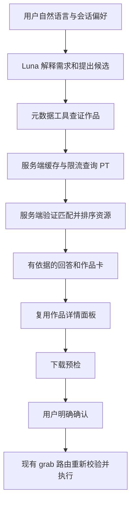

# Feature：AI 观影推荐与 PT 资源选择

> 历史归档：保留当时的方案、状态与验收证据；文中的“当前”“待实施”和恢复指令只适用于记录当时，不代表现行配置或新的执行要求。现行入口见 [文档导航](../../README.md).

编号：AI-001。日期：2026-09-07。状态：2026-09-08 用户批准；已实现于功能开关后，验收记录见运行说明。

本文是已批准的开发合同；实际运行与验证结果见 [AI 运行说明](../../operations/AI_OPERATIONS.md)。依据见 [调研与实测](AI_RECOMMENDATION_RESEARCH.md)。

## 1. 用户结果与范围

用户可以说「最近想看轻松一点的科幻，不要恐怖，1080p、15GB 以内，最好免费」，收到 3–5 部有依据的作品推荐、推荐理由、约束满足情况、PT 检查状态和优先片源；能继续说「第二部看过了，换几部」「只要有资源的」「第二部哪个版本合适」。推荐序号绑定该条消息的作品卡 ID，不能靠模型回忆猜测。

「帮我下这个」打开所选资源的现有确认流程。第一版的“优先下载哪个”是推荐顺序，不改变 qBittorrent 队列优先级，不自动下载。免费为软偏好，只有「只要免费」才是硬条件；看过的片在当前会话排除。

第一版包含多轮偏好、候选解析、PT 查证、版本排序、结构化卡片、显式下载确认、取消与降级。排除长期画像、后台订阅追剧、无人值守下载、批量下载、站点新增/配置、外部网页浏览工具、向量库和多 Agent。

## 2. 端到端流程

模型提出最多 5 个候选搜索词；服务端从元数据解析出 ID，按标题、年份、类型消歧。同名无法消歧时问一个必要问题；一般风格描述不要求用户先填表。首轮优先返回最多 3 部经过 PT 检查的作品，其余可显示“未检查”；如果用户明确“只要有资源”，只将已验证匹配且满足硬条件的作品列为推荐，数量不足就如实返回，不能无界扩搜。

追问沿用约束，只有用户明确更改才覆盖；冲突先澄清，不能悄悄放宽大小/排除类型等硬要求。元数据缺少某项时展示未知，严格条件无法核实时不列为满足条件。

## 3. 架构与模块

新增 `src/server/ai/`：

- `provider.ts`：读取服务端配置、调用兼容 Chat Completions、规范化错误/usage；默认 Luna，不自动切换收费模型。
- `orchestrator.ts`：有上限的工具循环、请求取消、每轮预算和最终结果验证。优先 AI SDK；通过适配器隔离 SDK 类型。
- `tools.ts`：只读业务工具、Zod 参数检查、ID 权限校验、结果裁剪。
- `conversation-store.ts`：会话所有权、用户偏好、已展示实体、最近上下文和排除作品。
- `recommendation.ts`：结果 schema、证据引用、资源排序与字段置信度。

修改 `app.ts` 注册 AI 路由并注入现有业务 service；`config.ts` 加功能开关和 provider 配置；`discovery.ts`/`prowlarr.ts` 协调引用生命周期与字段证据；`shared/contracts.ts` 增加 AI 类型。客户端新增 `useAssistant` 和推荐卡，`App`/`ChatThread` 接入，详情及确认复用 `MediaInspector`。AI service 调用同进程方法，不用 HTTP 自调用绕鉴权，也不暴露内部原始 service 对象给模型。

## 4. 模型工具合同

所有 object schema 拒绝未知字段，字符串有长度上限，模型提供的 ID 必须来自当前会话已解析实体集合。工具输出是专用最小 DTO，不能直接序列化整个原业务对象。

| 工具 | 参数 | 行为与输出 |
| --- | --- | --- |
| `resolve_media` | `query` ≤120 字，`limit` ≤5 | 调用 `searchMedia`；返回 canonical ID、标题/年份/类型、可用简介和来源证据 ID |
| `get_media_details` | `mediaId`、`mediaType` | 已知作品详情；字段缺失显式 null，演员/导演数量受限 |
| `check_pt_availability` | 已知 `mediaId`、`mediaType` | `getMediaReleases` 缓存优先，最多50个候选在服务端排序；模型仅获前5个摘要；不接受 forceRefresh |
| `rank_releases` | `mediaId`、已验证的偏好 | 对已取得快照作纯计算；输出排名、理由码、字段证据和排除原因，不额外搜索 |

偏好 schema：媒体类型、类型词/排除词、年代范围、情绪描述、已看 ID、resolution、maxSizeBytes、freeleechRequired、freeleechPreferred；新增偏好必须经 Zod 校验。保存规范化偏好而不是让客户端传任意 system/tool 消息。

模型工具表中没有 grab、刷新、任意 URL、shell、SQL、文件读取或 PT 凭据工具。模型调用未知工具拒绝执行；参数不合法只允许一次同模型修复，然后结束本轮并保留已有有效结果。

## 5. 两级排序与证据

作品排序：首先满足明确硬约束，再结合用户风格和已看排除；模型可给风格建议，但引用可验证简介/类型。是否有资源独立字段；没有资源不等于作品不值得看。

资源排序在服务端进行，模型只解释结果，不能修改数值和最优 release ID：

1. 匹配门槛：校验作品标题/别名、年份、电影或剧集类型；标题 token 标准化后匹配，不把仅有搜索结果视为正确资源。歧义年份、剧集季集未确认标记 `possible`，不给“可直接下载”首选。
2. 硬过滤：torrent、匹配已确认、用户要求的分辨率/大小/免费；未知不算满足硬条件。
3. 可用性：做种数已知且 >0 的优先；0 或未知放到待确认候选，不能称已验证可下载。
4. 合格集合使用稳定排序元组：软分辨率偏好命中 → 软免费偏好命中 → 做种数降序 → 大小升序 → release ID。没有指定质量时不臆定“4K 一定更好”。展示最多3个版本。
5. 返回可解释 reasonCodes（如 `WITHIN_SIZE_LIMIT`、`PREFERRED_RESOLUTION`、`MORE_SEEDERS`）以及各字段证据；前端本地映射中文理由，模型不得补造字幕/音轨/画质承诺。

当前 `freeleech:boolean` 会将缺失合并为 false；新增兼容字段 `freeleechState: yes|no|unknown`，保留旧字段供旧界面兼容。分辨率/编码等增加 `evidence: upstream|title_inferred|unknown`，缺失 size/seeders 不把零当已核实值。严格“只要免费”只接受上游明确肯定。免费时效无保证，确认前展示快照时间；上游未提供时不显示具体优惠截止时间。

本 feature 必须覆盖标题/年份/季集歧义回归数据，不宣称标题启发式等价于 tracker 精确 ID 匹配；无法证明就 possible。NAS/重复状态在预检时检查，AI 排名不保证尚有空间或一定无重复。

## 6. 缓存与下载引用

继续 canonical mediaType + itemId 的 24 小时成功/空结果缓存和原有串行 1.2 秒节流；错误不缓存为 unavailable。更换推荐偏好仅对快照重新排序。人工刷新仍走现有 CSRF POST；AI 不能强制刷新。此缓存是单进程内存，重启后会失效，第一版不宣称持久化“自然日最多一次”。

新增 `snapshotId`、`checkedAt`、`expiresAt`、`actionableUntil`。解决15分钟 release ID 与24小时快照冲突的拟议实现：让快照持有的原始 release 引用与快照共同到期（最多24小时），保持原始数据仅在服务端；按快照的有界容量一起回收。普通手动搜索的引用仍可保留15分钟。总上限建议200快照/10000原始条目，超过则 LRU 回收，被回收引用返回明确过期状态，不静默找一个相近种子替代。

到期或服务重启时，卡片保留显示信息但禁用旧下载引用，引导用户显式刷新，再重新选择并确认。不给旧ID偷偷重新绑定新种子。预检与提交照常执行 NAS、重复和下载开关检查；引用仍在有效期也不代表 tracker 下载链接/优惠必然有效，上游拒绝应明确报错并允许刷新。

## 7. HTTP 与前端合同

`POST /api/assistant/turns`：会话认证、exact Origin/CSRF、rate limit。body `{conversationId?: string, clientTurnId: UUID, message: string}`；message 1–2000 字。conversationId 服务端生成并绑定会话，其他会话访问返回404；客户端不能提交工具结果、任意历史或模型 ID。

第一版使用非流式 JSON（当前已测协议），提交后即时显示“正在查找推荐”，可取消；不要伪造细分阶段。输出 `{conversationId, turnId, text, preferences, recommendations, warnings, usage?}`。每张卡包含 `{cardId, mediaId, mediaType, reason, evidenceIds, constraintResults, availability, checkedAt?, snapshotId?, rankedReleases}`；availability 为 `unchecked|available|possible|unavailable|error`，依据工具结果由服务端填写。LLM 生成的 final JSON 用普通文本解析加 Zod 校验，不假定网关 strict schema 可用；一次修复仍不合法时用已有有效工具结果生成确定性卡片，丢弃未验证结论。

响应事实字段必须从服务端实体/快照合成，不信任模型复述的数值或伪造 ID。自由文本经长度限制并禁止渲染原始 HTML；资源存在、排名、数量等事实以卡片为准，输出验证失败不发送该段模型文本。

`POST /api/assistant/turns/:turnId/cancel`：同样鉴权/CSRF，取消当前执行，停止后续工具；已发上游请求可能已计费，不承诺退费。客户端断开也触发 abort。相同 clientTurnId 返回已有结果或执行中409，不能重复计费；不同消息在同会话运行中返回409。完成结果内存保存30分钟。

`DELETE /api/assistant/conversations/:id`：鉴权/CSRF，清空所属对话并取消正在运行请求。会话默认24小时不活动过期，最多100个会话，每会话最多20轮；模型上下文最多最近8轮 + 规范化偏好 + 被引用卡片，不依赖额外付费摘要调用。重启后提示对话已过期重新开始；不静默复用旧实体。

错误码：`AI_DISABLED`、`AI_UNAVAILABLE`、`AI_TIMEOUT`、`AI_BUDGET_EXCEEDED`、`AI_INVALID_OUTPUT`、`CONVERSATION_EXPIRED`、`TURN_IN_PROGRESS`。PT/元数据部分失败走 warnings 和分卡 error，不把整轮都抹掉。UI 提供“按片名搜索”退路，不静默把 AI 回答伪装成成功。

发现和手动搜索保留；新增“AI 推荐”入口，三者打开同一详情面板。移动端卡片可滚动并打开原底部详情，下载确认保持独立。用户说“下第二个”解析到具体卡片并打开确认，文字本身不设置 `confirm:true`。

## 8. 预算、配置与隐私

建议初始硬限额：每轮最多4次模型请求（含修复）、8次工具执行、5个元数据搜索词、3个不同作品 PT 检查；每部最多原文/中文两个搜索，即最多6次真实 PT 请求。缓存命中不消耗上游次数，但仍计工具调用预算。预算在每个执行入口扣减，不能用单次 batch 绕过。

每次模型输出上限1200 tokens，每次发送上下文不超过12000 tokens（适配器实现计数或保守裁剪）；模型单次超时30秒，整轮60秒。最多同会话1轮、全局2轮，每会话每分钟3轮、全局每小时60轮（可配置）；模型失败不自动重试，参数修复仍算一次请求。上游429尊重 Retry-After 提示稍后重试，不循环睡眠占任务。使用返回 usage 记录消耗；缺失记 unknown，未核实网关价目之前不显示精确金额。

新增配置（拟议）：`PT_MEDIA_AI_ENABLED=false`，`TRANS_STATION_BASE_URL`，`TRANS_STATION_API_KEY` 或 `TRANS_STATION_API_KEY_FILE`，`PT_MEDIA_AI_MODEL=gpt-5.6-luna`。未启用不请求模型、不影响 `/api/live` 和现有功能；启用且缺关键配置时 AI 单独不可用。部署需显式将 secret 注入服务器，开发机环境不会自动进容器；不复制整个 env。baseURL 必须为运维固定 HTTPS 地址，不能由请求参数修改。

模型可接收用户当轮文字、有限会话偏好、公开影视元数据、用于比较的最少片源摘要（标题/大小/做种数/优惠状态）；不发送 Cookie、passkey、Prowlarr key、原始 GUID/下载URL、NAS路径、全量下载历史或真实站点地址。服务端把 indexer 转为无地址的站点标签。部署说明清楚说明这些信息会送往已配置网关。

影片简介和资源标题均是不可信数据，不执行其中指令。仅提示词不足以防护：工具白名单、ID集合、schema、预算、独立下载路由共同限制权限。日志只记 turnId、耗时、usage、工具名、结果数量和错误类别，默认不记录对话/HTTP body/认证头，不启用外部 tracing。

## 9. 开发切片与验收

所有切片属于同一 feature，完成以下门槛后才可称实现完成；每片可独立提交。

| 切片 | 内容 | 可验证完成条件 |
| --- | --- | --- |
| A：provider 与会话 | 配置、适配器、认证路由、内存生命周期 | mock provider 单测；显式运行 Luna auto-tool/多轮/错误映射 smoke；未配置旧功能可用 |
| B：查证与排序 | 只读工具、实体证据、预算、缓存生命周期和字段置信度 | fixture 验证工具白名单、硬条件、同名年份/季集歧义、24h缓存、引用过期、不自动刷新 |
| C：完整对话 UI | 推荐卡、指代、偏好更新、取消/清空、旧详情整合 | 桌面/移动浏览器验证完整推荐→详情→预检→确认流程，mock grab；不产生真实下载 |
| D：稳定性与上线说明 | 限流、部分失败、secret部署文档、回退 | typecheck、现有全量测试、build；明确配置后只读真实PT联调，不通过真实下载验收 |

固定至少12组场景：泛类型推荐；情绪+排除恐怖；大小和清晰度；软免费与只免费；同名不同年份；剧集季集含糊；“第二部看过”；“只看有资源”；全部空结果；PT报错；伪造工具/资源ID与简介注入；引用过期。另覆盖跨会话越权、并发重复提交、取消、超预算、模型无效输出/429/超时、服务重启。

通过标准：所有硬约束违规为0；每张“有资源”卡均有该作品可核查快照和匹配证据；未知字段不捏造；工具链没有下载能力；同作品跨轮/入口缓存命中不重复查询；模拟用户明确确认才调用一次 grab。真实模型 smoke 单独显式启用，不纳入默认测试和CI收费。

推荐主观质量由 review 后的固定示例人工评估：至少8/10条测试需求有合理理由与可解析候选（元数据不可用单独计服务失败，不算模型质量通过）。若未达标，调整提示词/候选策略后再验收；基础工具调用成功不等于推荐质量通过。

## 10. Review 默认决策

建议接受：嵌入式 AI SDK 编排 + Luna；会话内记忆；每轮自动查最多3部；确定性版本排序；显式下载确认；原始资源引用按推荐快照共同到期；非流式第一版。若这些默认项通过，开发无需再讨论是否安装独立 Agent。

后续可选项另立 feature：流式进度（先实测网关）、正式授权影视数据源、长期偏好与反馈、持久化会话、追剧订阅和队列调度。本次不包含。
